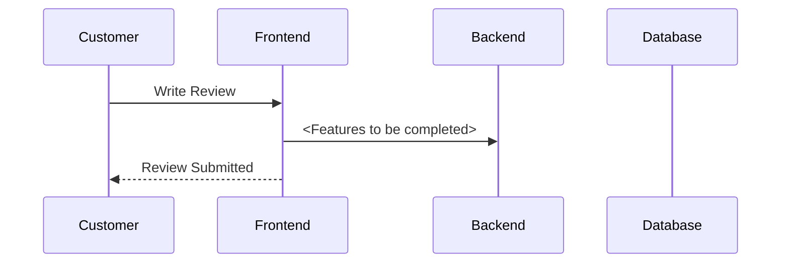

# tmp-demo

## Objective:

Design the backend functionality for the review submission process on BrightWave’s website.

## Deliverables:

1.	Sequence Diagram: Clear visual representation of the interaction flow.
2.	API Contract: Detailed document outlining endpoints, parameters, and responses.

## Key Functional Requirements:

**Writing a Review**
- 	Customers can provide written feedback and select a star rating (1–5).

**Input Validation**
- Check for:
  - Profanity: Ensure reviews are free from offensive language.
  - Completeness: Validate both text and rating are provided.
  - Verified Purchasers: Only allow reviews from users who bought the product.

**Storing the Review**
- Save valid reviews in the database, associating them with the product and user account.

## Tasks:

1.	**Sequence Diagram**
  - Illustrate how data flows between:
    - Frontend (Customer Interface)
    - Backend Review Service
    - Database
  - Either;
     - Visit Draw.io to view and make any necessary updates - [Draw.io - Sequence Diagram](https://app.diagrams.net/#R%3Cmxfile%20pages%3D%222%22%3E%3Cdiagram%20id%3D%22i7KtP-Vs8fw_sYRqWalm%22%20name%3D%22Sequence%20diagram%22%3E1Vpbc5s4FP41fqwHIa6PiS%2FtziTTTLOzTfdNBtlWIiMWhC%2F99SsZYRBgGzs4bXnIoKMr5%2FvOTc4AjlbbzwmKl48sxHRgGuF2AMcD0%2FRsIP5KwS4XuC7MBYuEhLkIlIJn8hMroaGkGQlxqg3kjFFOYl0YsCjCAddkKEnYRh82Z1TfNUYL3BA8B4g2pd9JyJfF6YBfdnzBZLEstoamOvkKFaOVIF2ikG0qIjgZwFHCGM%2FfVtsRplJ5hWLyedMjvYeTJTjiXSa8xPG%2F0%2BnaXBIwef1KXqdfx%2F4nM19ljWimvngA70ZZytkKJ%2BrcfFdoQ3xCLF%2BzFX0gc0xJJFr34gicBCRG%2B3OIvruAs0R24ISsMBcLwTFV459K2f2Sr6joAuJV4MeR6E4ObUpRnJLZfmtDSBIcZElK1vgbTnOaSOkay70RvaNkEQkZZ7GQpjEKSLT4WzbG0BESlnG5%2B%2BhAEzlZrWPJ9zmhdMSoPLf4Ujj3AhwEcgxP2Buu9Mw827LljKb%2BFSTyTHhbESk8PmOhVJ7sxJCiFypuKOvwVHNTUq1gz7JCMruYhhS7F4eVS%2FzFi6LABXSATTrUOVABLWYk4vsj2PcDe1xDnCV8yRYsQrSKeR96Psnkzsq3NdW7TdWDFtVb5q1UbzVU%2Fx3PUsJxVys8Y2ybpVjrWRiGnLoRzrofA2w1rDrIc%2By0gxy6%2FszoyZgOECpE%2FTZE26zpZpDaH25N1yj6JBs7a9%2FSzanFk7WZE%2FRupftit4ryR5QEbwOJtvNfJqOuoPSa4E3ZPgVPPdLMGBdBUnTgKLyTmYaUUSZ2kCLxCS%2FKGPaNH4URsSwKcahaR1mfsiwJ8HlHzVGywKdwVKjgUEtzmigmmCIubFtPoFpAUVOfJFkrtleDH7g1XPMPUrNq0B6O8Q60QQPtexS8CWj%2BfO8ZIuzNW43aCTw8m%2FfjPS3%2Fd%2FOeoCU3va37vErTp%2Fl4rf8EoKMDtXtQ%2Fyh7HE1%2B%2FvPycC9CyBSFX%2F56fPsEmgmJcJRoJZlPpbOcY8SzRKQnRtmxOOdFkfKeFM95mag%2F7Ftjs92b6j5TurJntXaJ6qSU3gtDWx%2BGtzncmjfs4EYLLnYEvnf%2FatfY4Xdzr0KTaFcZpmzk6DZe%2BzbTbsNrBah4yfdvn%2BwYQ6PygIJv5WJDA1qWZ7q255iGp39wjlgf8aSd%2FG2pWzv54Z9O%2Ft%2BE06b1IZwutunKafcSTtc%2FqZ4F9cfadqCa5fsYcTRDaecisn6VM4k44btflyC9636nFt4xCG3stoV333EhcvpJpBznbCJlfWwe1RbIb5pHXaXo04zufqWmmyDsWIjWnU9v2jeblUlD%2BxW3H7G9HYYoXe79NtDNqBYNijITaGXm0HadQjDeVseOd9VWBcFcuCX8pfJeLAZVu1xLNnaVRn2lo2Z0tg6twGS3WYmSvTP0AK9uo%2F7Q8Pzy6RSJmrHDqC0LRA7jHl32xtHAtJpEq6QPimk6o0rzfmB75yqZ9Yo536mfZlDGmU7JCnlZjKNcMiXyrPslNSofJcbZCw9l1mczddiRaJcx6NKkw6xd7NvWiTSir6S16edF9Ja%2F4hhzjMMZ2l9%2BIXklYiTi26PFqTBwyXVXzSsVbmQoLEJzJQC6F7sSjT6y8YS46JVHEiWB4XXLa2%2BTwULgDqXRF4%2BpZ3%2BGXuEYznVeBUB%2F6IGyFgLORdvcuFJqFkrP2WxF5Pm%2FqdvV25IMOo5GMtOxr4xXv4BBAHpDkTCWj6dja%2FpDv%2FpY11EIAn9oV3YxL9rlxgxyWhKkaqm9919FtS00bNQLbtWKZmnc4x3%2BxbXzjXyMqUcS0%2BlWJjdrU3iSA%2FVlrwZdNMv%2FaciHl%2F8ZAif%2FAw%3D%3D%3C%2Fdiagram%3E%3Cdiagram%20id%3D%22hbYBUEr95w08JzggDiKY%22%20name%3D%22With%20loop%22%3E5Vpbc6M2FP41nmkfsgMIbPzoS9KdaTq703R2t08dAQKTyIjKcmz31%2FcIxFXYeB2TpFtnMkZHV3%2FfuXFghBbr%2FS8cp6vfWEDoyDKC%2FQgtR5ZlImTBl5QccsnURbkg4nGgBlWCh%2FgfooSGkm7jgGwaAwVjVMRpU%2BizJCG%2BaMgw52zXHBYy2tw1xRHRBA8%2Bprr0axyIVXE6c1p1fCRxtCq2RpY6%2BRoXo5Vgs8IB29VE6HaEFpwxkV%2Bt9wtCJXoFMI8Lx5iEPvvr26%2FLj18fv3h4gW7yxe6%2BZ0r5GzhJxHWXVuw%2BY7pVgG0CaJM9XqcAoWXsYkABqIB%2FyliqkBCHAl8AJZWX2zW943gNl%2FPdKhbkIcW%2BlO9ArUC2EmsKLVN2KxpMx5AdBfZItjy2TQIS3HvF4GfCRQxszmgcJSBbx0Egt55jJaAkhNnzDWwXJ9F91lo6IAljSheMMp6dE4WO%2FJNyloiaPP%2FIFQRnT6TWM84%2B0KMggpOQfUupeggxSy0B%2ByJsTQQ%2FwDy1SqFXyrKQau4qNZ3YSraqaag9VUKsTCMqV67YhwulAN%2BhDEhThhGaffIepV2e4P0%2BDgmNE8lKSngMZyESQqrEnytZn2qAExAYpvCyTSlON7GX7SoVhBN%2FyzfxM%2FmdbHJfI6VsK%2BROi9KHGLoCBJi4od9JtO8SLxyQaNRi2tWZNo0upo2hmLZ1ptsE12hJWZyI7AjOfOQsWzwzLlYsYgmmdaYvxxKdxNJ2%2BqHUkbTsoZB0%2FrNIOk2lNK3zoHScgZAc66GI0FCmBlhOboFKAgjzqlnhdltJ637lZLAAiOYkCWYy2YCmR5n%2FJD1NHoqUMwGg%2BeGbWi5r%2FKl68pPJ41xADiRDmEfk1Dinm0ROKBbgB5sJUwcnaupnqXk18ptmZBotVjdsy32iJlXEAkj4UBum9PnoNm73NpWa5AtWSlP%2Bwsv1aNJvkUeCF5a5RpzijDfom%2FlCxoi3imrt3EewtFLeP2RjicZnRr%2FQ9YnfGf0817EdY8DoN%2B312FZX7DOH8tjuO%2FbYk9MeuwHk5Dx%2FjQZLIqYakEEM2in81SlA21rtMSHYOtNMsL%2FCCzNYtdsvZ8PUfaar%2BelLvfHkTG%2FsDuKNb5xuanu88bU8ZqE212Kyg7Uyfhrt%2BHkd%2FtS4HKh%2B4%2B%2Fl2R6EZ8to5VzjVyba1H2fM4fgtZb7Cw5CZ9mZat1jj9DupMoHZjK3d%2FRencuohqtwp%2FvUox5TlYXU5FEZKvoVwuhmsLA444PruG6DDRUHXsqx1Vi00LhiARaGGzIMuXothxOx5clLbZilBLrmAd6sMjvNU%2BCg5oPJPhalccN1Ztsfps6rm7f9pm68bd4WGjeXyM81nHn%2F2AUch7iB3ZXCupaHBq3UlSW3d1PAMd9zBcfsKeHYTSsxzktk3cGw1Gs4P2r6c65%2FNIfJf9CkRX2b06HzH73G9L8Lkea5OjCMCozdpiu1UUsFho6RZ5SHImAkPer%2BLk9JT3pFa9LMRs2O%2B3uEbN0vmoM9DzL1UsmVngG2q1MhGXdXp4LJ1DNeWJ06UlR5Q1z1ysnIGlNVmk4a4I7%2F3srny9ljy5s8Y5rBANNM9xkqhof9pyhzITd%2Bjpvs55H3U1bkhRMa9Yufs1nFqnAVZd8dd4H5geAH5mdSA9vcAx1iuPtCvBVMpYmmph4Jy1LWui4p0fWVpXhGa2k2OelIVayhNKd8FaEioBk9qlTunmUVYgnbIxHioGKRRLTJVy2MKfhAchfLg2VLNoLapYY7XDwr3yrpzWleetP3Mub00sunhMr9WZKLYTqskVnhMQebMEHk4yrtNYked6tMyHKOPlXQjPZVPfTJwDhGrbvqrvuFrkcI7eLaGVxCs3qfJ085qtei0O2%2F%3C%2Fdiagram%3E%3C%2Fmxfile%3E)
     - Modify the Example Sequence Diagram in this docuemnt using `mermaid` syntax

2. **API Contract**
  - Design the API contract for the review submission process by modifying an OpenAPI specification.
  - 
## Example Sequence Diagram

